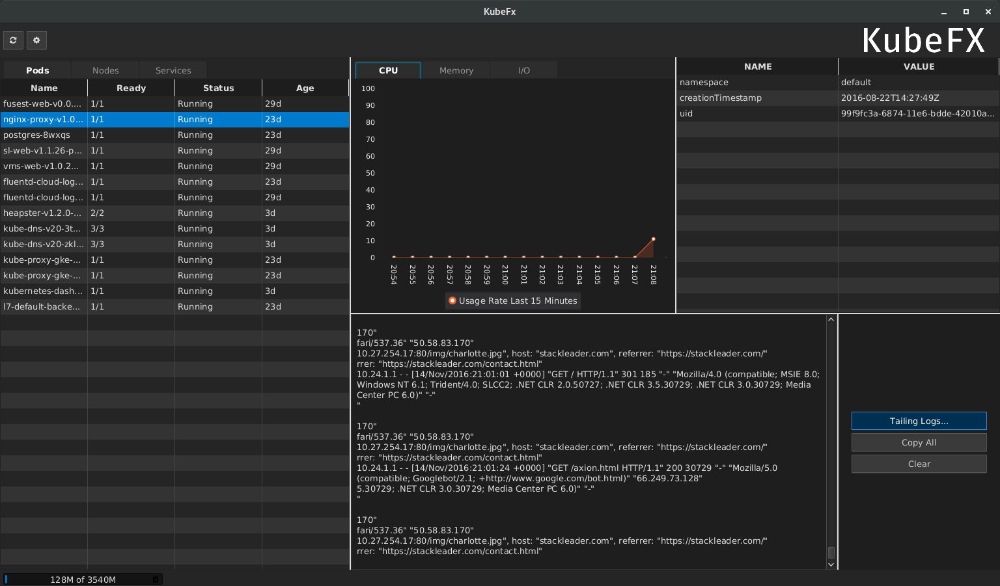

KubeFx
======

An open source tool for working with kubernetes written in JavaFX.

Features
--------

  * Kubernetes credentials parsed from kubectl configuration or added manually
  * Provides status of Nodes, Pods, and Services
  * Tail logs
  * View Detailed information on Nodes, Pods, and Services
  * Heapster metric charts on pods/nodes 
  * Extensibility through plugin api 

TODO
----

  * Add an overview tab for big picture metric charts and info on all pods / nodes 
  * More features (longer term aim is as close to 100% API feature support as makes sense for the tool)
  * Namespace filtering
  * Grep and filter functionality for log tails
  * Log tail aggregation
  * Heapster configuration options (currently this feature is expecting GCP style setup)
  * Plugin API Documentation
  * TBD

Requirements
------------
 TBD

Installation
------------
 TBD

Changes
-------

See [Change Log](CHANGES.md)

Credits
-------

License
-------

*KubeFx is open source licensed under the [Apache License Version 2.0](LICENSE)
